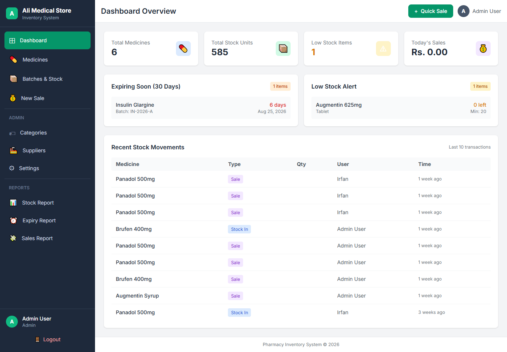
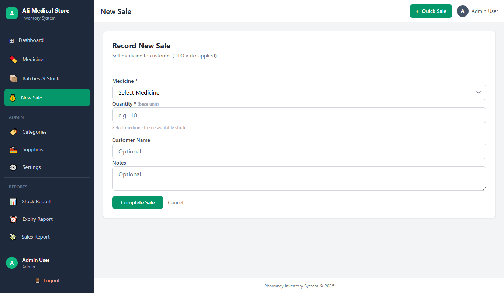

<<<<<<< HEAD
<p align="center">
  <span style="font-size: 40px;">💊</span>
</p>
<h1 align="center">PharmaStock</h1>
<p align="center">
  <b>Smart Pharmacy Inventory Management System</b><br>
  Built with Laravel 12, Livewire Volt & Tailwind CSS
</p>

<p align="center">
  
  
  
  
</p>

---

## ✨ Features

| Feature | Description |
|---------|-------------|
| 📦 **Batch Tracking** | Track medicines by batch number, expiry date, and supplier |
| ⚡ **FIFO Logic** | Automatic First-In-First-Out stock deduction on sales |
| ⏰ **Expiry Alerts** | Color-coded warnings for expired & expiring-soon medicines |
| 📊 **Reports** | Stock, Expiry, and Sales reports with date-range filters |
| 🔒 **Role-Based Access** | Admin (full CRUD) vs Staff (sales & view only) |
| 🎨 **Dark Theme** | Modern glassmorphism UI with Tailwind CSS |
| ⚙️ **Dynamic Settings** | Pharmacy name, currency, and alert days configuration |

---

## 🖼 Screenshots

<p align="center">
  
</p>
<p align="center"><i>Dashboard with real-time statistics</i></p>

<p align="center">
  
</p>
<p align="center"><i>FIFO Sales with batch preview</i></p>

---

## 🚀 Installation

```bash
# Clone the repo
git clone https://github.com/YOUR_USERNAME/pharmacy-inventory-laravel.git
cd pharmacy-inventory-laravel

# Install PHP dependencies
composer install

# Install JS dependencies
npm install
npm run build

# Environment setup
cp .env.example .env
php artisan key:generate

# Database setup
php artisan migrate
php artisan db:seed --class=DemoDataSeeder
php artisan db:seed --class=SettingsSeeder

# Serve
php artisan serve
